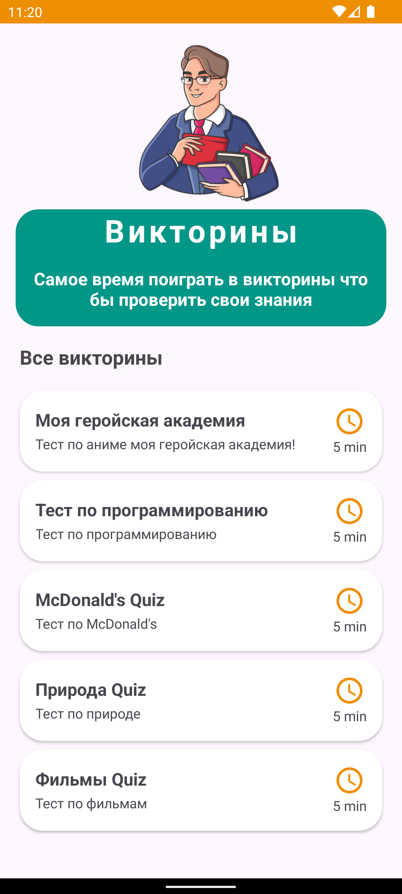
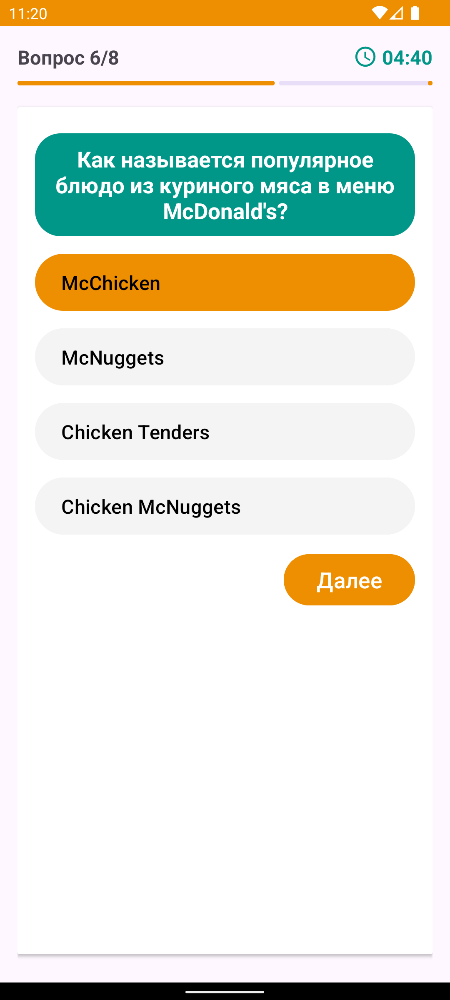
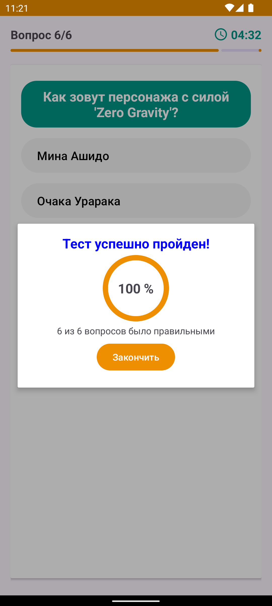

# Quize App

  
   
  

## Приложение для Викторин

- Вопросы берутся из firebase

- Rv для списка викторин

- Описание вопроса и 4 варианта ответа

- Таймер завершения викторины

- Далог алерт в конце с результати
